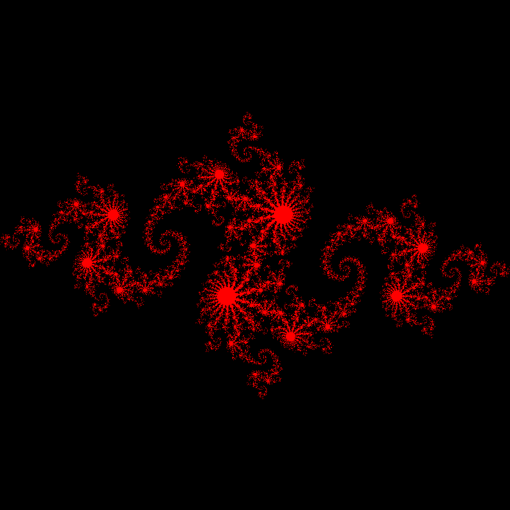

# Julia Set using GPU (Nvidia CUDA).
Creating Julia set representation using OpenGL and Nvidia GPU. Based on "Cuda by example book".

## Setup
1. Install latest nvidia c++ compiler(i.e nvcc).
2. Build command for the program, it is present in `julia_set` folder.
    ```
    nvcc gpu_julia.cu -o gpu_julia -lglut -lGLU -lGL
    ```
3. To render graphical image.
    ```
    ./gpu_julia
    ```

You will obtain below image.

